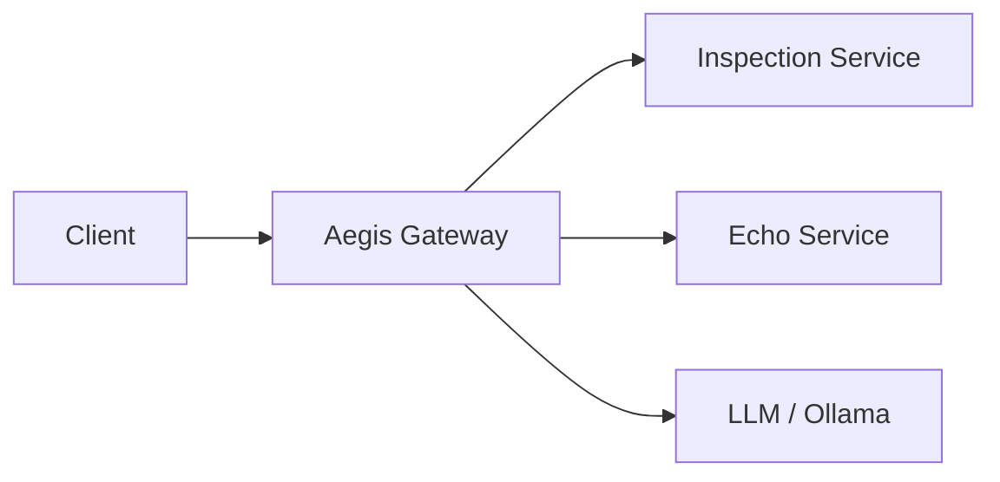

# Aegis Gateway

**Aegis Gateway** is a security-focused reverse proxy that inspects, evaluates, and controls LLM (or generic HTTP/API) requests *before* they reach a target system.

It is a **reference implementation for LLM / API egress hardening**, with a strong focus on:

- Preventing **PII leaks** and **secret exposure**
- Mitigating **prompt injection** and unsafe request patterns
- Enforcing **policy-based decisions** (`allow` / `confirm` / `block`)
- Staying **operationally realistic**: Docker → Compose → K3s / Service Mesh

---

## Architecture

At a high level, Aegis Gateway sits between external clients and internal target services. The gateway is the only client-facing component and terminates HTTP, evaluates policies, and orchestrates calls to the inspection service. The inspection service runs PII and secret detection plus heuristic checks and returns a structured report, it never talks directly to external clients. Target services (Echo, LLM, or any HTTP API) remain unaware of the inspection and behave like normal upstreams. Multiple routes can share a single gateway instance, each with its own policy configuration and target cluster. The inspection service is stateless and can be scaled horizontally behind the gateway.

```text
Client
  ↓
Aegis Gateway (ASP.NET + YARP)
  ├─ Policy Evaluation (Allow / Confirm / Block)
  ├─ Confirm Flow (TTL-based tokens)
  ├─ Logging & Audit Hooks
  ↓
Inspection Service (FastAPI)
  ├─ PII Detection (Presidio + spaCy)
  ├─ Secret Detection (detect-secrets)
  ├─ Prompt Injection Heuristics
  ↓
Target Service
  ├─ Echo (Demo)
  └─ Ollama / LLM (optional)
```

Alternative view:



> Echo and Ollama are **alternative** demo targets (enabled via Docker Compose profiles).

Key properties:

- **Only the gateway** is publicly reachable
- **Inspection Service** is internal, stateless and configuration-driven
- **Policies live in the gateway** (not in the inspector) for clear separation of concerns
- Supports **multiple routes and targets** behind a single gateway

---

## Problem & Motivation

Modern applications increasingly call external LLMs (or other 3rd-party APIs).  
Typical risks:

- Users (or upstream systems) send **sensitive data** (PII, secrets, tokens)
- **Prompt injection** attempts try to bypass internal guardrails
- There is no **central place** to enforce inspection / policies
- Logs accidentally store **sensitive payloads**

**Aegis Gateway** addresses this by adding a **security inspection layer in front of your target**, without forcing you to re-architect your application.

---

## Core Features

- **Reverse Proxy Gateway (ASP.NET + YARP)**
  - Route-based configuration for:
    - Prompt inspection on/off
    - Prompt / payload format
    - Policy ID and severity thresholds
  - Policy engine that maps **severity → action**
  - Type overrides (e.g. `pii_iban` → `block`, even if severity would allow)

- **Inspection Service (FastAPI + Python)**
  - PII detection using **Presidio** + **spaCy**
  - Secret detection via **detect-secrets**
  - Configuration via **YAML** (analyzers, thresholds, categories)

- **Confirm Flow**
  - Requests that are not “clean” but not critical can be tagged as `confirm`
  - User / operator can explicitly confirm once
  - Confirm-tokens are server-side validated and time-bound

- **Security & Robustness**
  - Non-root Docker images
  - Read-only file systems with `tmpfs` for temp data
  - Health endpoints for gateway, inspector and (optional) LLM
  - No runtime model downloads
  - No secrets in logs or responses (only references / IDs)

---

## Request Lifecycle

1. **Client** sends a request to the gateway (e.g. `/api/echo`).
2. **Gateway**:
   - Checks route configuration (inspection enabled? which policy?).
   - Forwards relevant request data to the **Inspection Service**.
3. **Inspection Service**:
   - Runs PII, secret, and heuristic checks.
   - Returns a structured report with findings + computed severity.
4. **Gateway Policy Engine** decides:
   - `allow` → forward request to target
   - `confirm` → return a `ProblemDetails` response requiring confirmation
   - `block` → return a blocking `ProblemDetails` with high-level reason
5. On `confirm`, the client can send a follow-up request with a **confirm token**.

All responses in the control flow use **structured error formats** (ASP.NET `ProblemDetails`) so clients can react programmatically.

---

## Components

### Repository Layout

```text
.
├─ services/
│  ├─ gateway/                 # ASP.NET + YARP reverse proxy + policy engine
│  │  ├─ Dockerfile            # Gateway container image
│  │  ├─ Aegis.Gateway/        # Gateway app + YARP routes/policies
│  │  └─ Aegis.Gateway.Tests/  # Gateway tests
│  └─ inspection/              # FastAPI inspection service (PII/secrets/prompt heuristics)
│     ├─ Dockerfile            # Inspection service container image
│     ├─ core/config/          # YAML-based inspection configuration
│     ├─ core/detectors/       # Implementations of injection, PII and secret detectors
│     ├─ infra/                # Infrastructure-related code (logging, wiring)
│     └─ tests/                # Inspection tests
├─ docker-compose.yml          # Demo stack using compose profiles (echo / ollama)
├─ Makefile                    # Primary DX entry points
├─ renovate.json               # Dependency automation (Renovate)
└─ .github/                    # CI, security scans, dependency automation
```

> Paths may evolve slightly over time, but the `services/` split is the core structure.

### 1. Gateway (ASP.NET + YARP)

- Reverse proxy routing configuration
- Route metadata controls:
  - `InspectPrompt`
  - `PromptFormat` / payload extraction hints
  - `PolicyId`
- Policy engine:
  - Severity thresholds per policy (e.g. `low: allow`, `medium: confirm`, `high: block`)
  - Type-based overrides
  - Centralized mapping to `allow` / `confirm` / `block`
- Confirm-flow:
  - Short-lived confirm tokens
  - Server-side validation (not trust-on-first-use)

### 2. Inspection Service (FastAPI)

- Single `/inspect` endpoint (JSON in, JSON out)
- Uses:
  - **Presidio** + **spaCy** for PII extraction
  - **detect-secrets** for credential patterns
- Configuration:
  - YAML-based, immutable at runtime
  - Defines analyzers, categories, and mapping to severities

> Design choice: **one inspector = one configuration**.  
> Multi-tenant setups are intentionally out of scope for now.

### 3. Demo Targets

- **Echo Service**
  - Minimal HTTP service that returns back what it receives
  - Used to demonstrate inspection without requiring a real LLM

- **Ollama / LLM (optional)**
  - Optional container for local LLM testing
  - Gateway only talks to Ollama over the internal network

---

## Getting Started

### Prerequisites

- `git`
- `docker` + `docker compose`
- `make` (recommended for DX)

### 1. Clone the Repository

```bash
git clone <YOUR_REPO_URL>
cd aegis-gateway
```
Replace `<YOUR_REPO_URL>` with the GitHub URL of your fork.

### 2. Run the Echo Demo

```bash
make compose-up-echo
```

This starts:

- Aegis Gateway
- Inspection Service
- Echo target service

### 3. Send a Test Request

```bash
curl -i \ 
  -X POST http://localhost:8080/api/echo \
  -H "Content-Type: application/json" \
  -d '{"model": "echo", "prompt": "Hello from Aegis Gateway"}'
```

You should see the echo response forwarded through the gateway.

### 4. Trigger Inspection

Send a request that contains obvious PII or secrets:

```bash
curl -i \
  -X POST http://localhost:8080/api/echo \
  -H "Content-Type: application/json" \
  -d '{"model": "echo", "prompt": "My email is john.doe@example.com and my API key is sk_test_123"}'
```

Depending on the configured policy, you should receive:

- A **blocked** response, or
- A **confirm** response with structured `ProblemDetails`.

Exact behavior is defined in the gateway’s policy configuration.

### Confirm Flow (Example)

If a request is classified as medium risk, the gateway can respond with a **confirm** decision.

- The gateway responds with HTTP **428 Precondition Required** and includes a short-lived confirm token in the response header: `X-Aegis-Confirm-Token`.
- To confirm, resend the **same request body** and include the token as a request header: `X-Aegis-Confirm-Token`.

```bash
# 1) Trigger a confirm decision (copy the token from the response header)
curl -i \
  -X POST http://localhost:8080/api/echo \
  -H "Content-Type: application/json" \
  -d '{"model": "echo", "prompt": "Contact me at john.doe@example.com"}'

# 2) Resend the same request with the confirm token
curl -i \
  -X POST http://localhost:8080/api/echo \
  -H "Content-Type: application/json" \
  -H "X-Aegis-Confirm-Token: <PASTE_TOKEN_HERE>" \
  -d '{"model": "echo", "prompt": "Contact me at john.doe@example.com"}'
```

### Blocked Request (Example)

Some findings are configured to **block** immediately (for example, certain PII types like IBAN). The gateway should respond with HTTP **403** and a blocking `ProblemDetails` response.

```bash
curl -i \
  -X POST http://localhost:8080/api/echo \
  -H "Content-Type: application/json" \
  -d '{"model": "echo", "prompt": "My IBAN is DE89 3704 0044 0532 0130 00"}'
```

### Demo Modes

Aegis Gateway ships with two demo modes out of the box:

1. **Echo mode (lightweight, no LLM required)**
   - Command: `make compose-up-echo`
   - Starts the gateway, inspection service, and a simple echo target.
   - Best for quickly validating routing, inspection, and policies without any model downloads.

2. **Ollama / LLM mode (heavier, realistic LLM setup)**
   - First start the stack: `make compose-up-ollama`.
   - Then pull a local model: `make ollama-pull` (downloads a small model via Ollama).
   - Gateway route for Ollama in this repo: `POST /api/generate` (Ollama-compatible payload).

Both modes expose only the gateway to the host. The inspection service, echo service, and Ollama are reachable only from inside the Docker network.

To stop the stack: `make compose-down`.

### Ports & Endpoints

By default (compose demos):

- Gateway: `http://localhost:8080`
- Echo demo route: `POST /api/echo`
- Ollama route (when profile `ollama` is running): `POST /api/generate`

> The inspection service and targets are **not** exposed to the host; they are reachable only inside the Docker network.

---

## Configuration Overview

### Gateway Configuration (Routes & Policies)

- Each route defines:
  - Target cluster (e.g. `echo`, `ollama`)
  - Whether inspection is enabled
  - Which policy to apply
- Policies define:
  - Mapping from finding categories to severities
  - Severity thresholds for `allow` / `confirm` / `block`
  - Type overrides (e.g. `pii_iban` or `secret_generic`)

Example:

```jsonc
{
  "ReverseProxy": {
    "Routes": {
      "echo" : {
        "ClusterId": "echo_cluster",
        "Match": {
          "Path": "/api/echo"
        },
        "Metadata" : {
          "InspectPrompt" : true,
          "PromptFormat": "ollama",
          "PolicyId" : "Default"
        }
      }
    },
    "Clusters": {
      "echo_cluster": {
        "Destinations": {
          "echo": {
            "Address": "http://echo:8080/"
          }
        }
      }
    }
    },
    "Policies": {
    "Default": {
      "DefaultAction": "Confirm",
      "SeverityToAction": {
        "low": "Allow",
        "medium": "Confirm",
        "high": "Block"
      },
      "TypeOverrides": {
        "pii_email":   { "Action": "Confirm" },
        "pii_iban":    { "Action": "Block" },
        "secret_jwt":  { "Action": "Block" }
      }
    }
  }
}
```

> See the configuration files in the repo for the exact schema and examples.

### Inspection Service Configuration (YAML)

- Defines which analyzers are enabled
- Configures thresholding and mapping to categories
- Controls PII / secret detection behavior

Example (pseudo):

```yaml
pii:
  enabled: true
  detectors:
    person:
      enabled: true
      severity: low
    email:
      enabled: true
      severity: medium
    iban:
      enabled: true
      severity: high
secrets:
  enabled: true
  detectors:
    high_entropy_strings:
      enabled: true
      severity: high
    aws_keys:
      enabled: true
      severity: high
    generic_api_keys:
      enabled: true
      severity: high
```

---

## Threat Model (What this protects against / what it does not)

This project focuses on **outbound HTTP/LLM request inspection**. It is not a full WAF or DLP product, but it covers a useful subset of risks.

### Helps protect against (within limits)

- **Accidental PII leaks** in prompts or payloads (e.g. emails, IBANs, IDs), depending on your Presidio configuration.
- **Accidental secret exposure**, such as API keys, tokens, or high-entropy strings that match the configured detectors.
- **Obvious prompt injection patterns**, when you configure heuristic checks for "ignore previous instructions", attempts to exfiltrate system prompts, or similar patterns.
- **Missing central egress control** by forcing certain targets (e.g. LLMs) through a single gateway + inspection path.
- **Uncontrolled logging of sensitive payloads**, by making logging behavior explicit and configurable at the gateway.

### Does *not* protect against

- A **compromised client** or upstream system that intentionally sends already-approved malicious or sensitive data.
- **Model-level issues** at the LLM provider (e.g. retention/training on your data, internal compromise, or misuse of responses).
- **Side-channel attacks** (timing, traffic analysis, or lower-level network exploits).
- **All forms of prompt injection** — heuristics can be bypassed by sophisticated attackers or novel techniques.
- Misconfiguration of your deployment (e.g. disabling inspection on a route, setting thresholds too lenient, or skipping authentication entirely).
- Threats unrelated to HTTP egress, such as local malware on developer machines or supply-chain attacks in your dependencies.

You should treat Aegis Gateway as a **layer** in a defense-in-depth strategy, alongside authentication/authorization, network segmentation, service mesh/mTLS, and organizational controls.

---

## Security Considerations

Aegis Gateway intentionally includes several hardening measures:

- Non-root containers
- Read-only filesystems (with minimal temp dirs)
- No dynamic downloads at runtime
- Health endpoints for all major components
- No logging of raw secrets or full prompts (configurable, but discouraged)

See [`SECURITY.md`](./SECURITY.md) for:

- Scope of this project
- Reporting security issues (responsible disclosure)
- What is **in scope** vs. **out of scope** for this reference implementation

---

## Deliberate Limitations

To keep the project focused and understandable:

- ❌ No built-in **authentication/authorization**
  - Use existing solutions (OIDC, mTLS, API gateways, service mesh) in front of or around Aegis Gateway.
- ❌ No multi-tenant configuration model in the inspector
  - A single inspector instance has a single configuration.
- ❌ Not a full “product”
  - This is a **security-focused reference architecture**, not a turnkey SaaS.

---

## Testing

The repo contains tests for:

- **Gateway** (.NET)
- **Inspection Service** (Python)

Typical pattern:

```bash
# Gateway tests (.NET)
cd services/gateway

dotnet restore Aegis.slnx

dotnet test Aegis.slnx --configuration Release

# Inspection service tests (Python)
cd ../inspection

python -m venv .venv
source .venv/bin/activate
python -m pip install --upgrade pip
python -m pip install -r requirements.txt
python -m pip install -r requirements-dev.txt
python -m pytest -q
```

Unit and integration tests avoid:

- Real secrets
- Real user data

---

## CI, Dependency Updates & Supply-Chain Signals

This repository is intentionally set up to look and behave like an **enterprise-grade** service repo:

- **Build & test workflows** validate both the .NET gateway and the Python inspection service.
- **Container image scanning (Trivy)** detects vulnerabilities in what you actually ship (including OS packages from the base image).
- **SBOM generation (Syft)** produces a software bill of materials for auditing and traceability.
- **Dependency automation (Renovate)** proposes update PRs with rate limits and grouping to avoid PR spam.


## Development Workflow

Recommended local workflow:

1. Run the full stack with Docker Compose (echo or Ollama).
2. Develop gateway (C#) and inspector (Python) in watch-mode against the running stack.
3. Use the `Makefile` commands as the main DX entry points:
   - `make compose-up-echo`
   - `make compose-up-ollama`
   - `make ollama-pull`

---

## Contributing

Contributions are welcome — especially around:

- New detectors (custom PII / secret patterns)
- Additional policies and real-world examples
- Deployment manifests (K3s, Helm charts)
- CI hardening (SAST, SCA, container scanning)

Please read:

- [`CONTRIBUTING.md`](./CONTRIBUTING.md)
- [`SECURITY.md`](./SECURITY.md)

before opening issues or pull requests.

---

## License

Aegis Gateway is licensed under the **Apache License, Version 2.0**.

See [`LICENSE`](./LICENSE) and [`NOTICE`](./NOTICE) for details.
